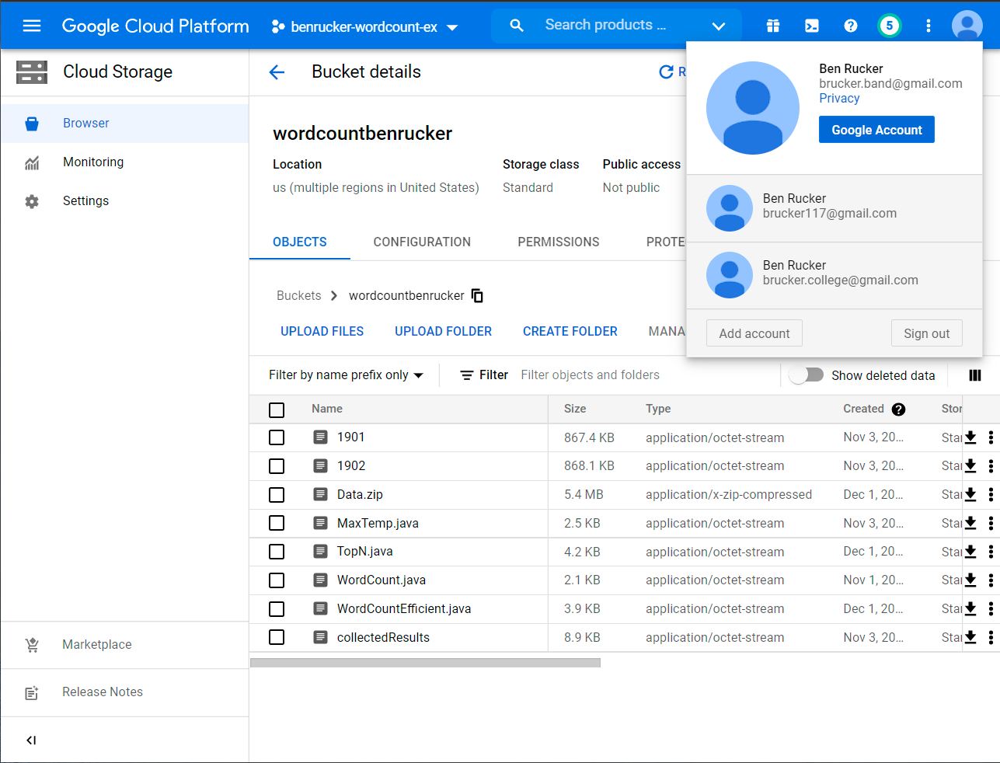
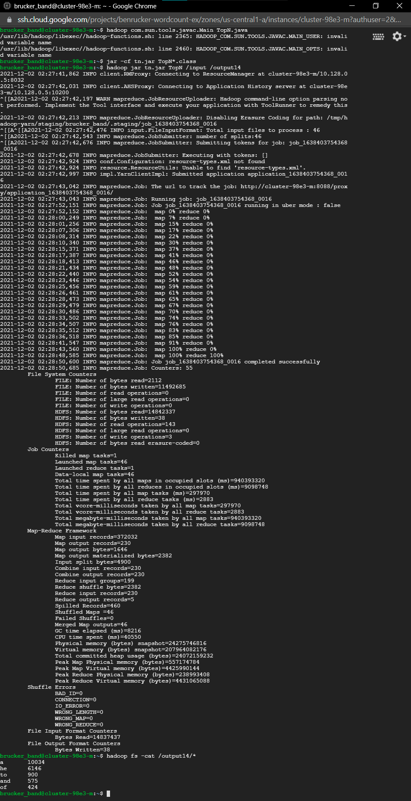

# Homework 5

## Screenshot with account name



## Screenshot of execution



## Source code

[TopN.java](TopN.java)

## Copy of the output

```
a       10034
he      6146
to      900
and     575
of      424
```