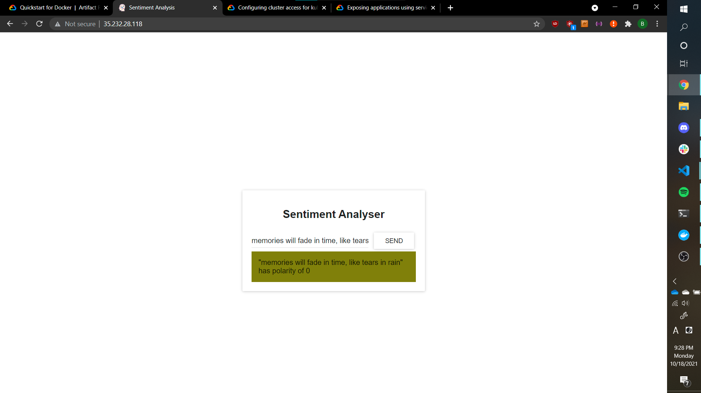

# Sentiment Analysis on GKE

Code is contained in [`Sentiment Analysis/`](Sentiment%20Analysis).

## Screenshot


## Docker Hub URLs
|  |  |
| -- | -- |
| Frontend | https://hub.docker.com/repository/docker/brucker/sentiment-analysis-frontend |
| Logic |https://hub.docker.com/repository/docker/brucker/sentiment-analysis-logic |
| Webapp | https://hub.docker.com/repository/docker/brucker/sentiment-analysis-webapp |

## Video
https://user-images.githubusercontent.com/12519846/137835969-2d02a9ab-add8-4068-83a4-d7cd362889ab.mp4

## Steps to make this happen

1. Pull the code from [here](https://github.com/rinormaloku/k8s-mastery)
2. Build the webapp
    * `cd sa-webapp`
    * `mvn install`
3. Build the webapp docker image
    * `docker build -t brucker/sentiment-analysis-webapp:1.0 .`
4. Push the webapp docker image
    * `docker push brucker/sentiment-analysis-webapp:1.0 .`
5. Build & push the logic docker image
    * `cd ../sa-logic`
    * `docker build -t brucker/sentiment-analysis-logic:1.0`
    * `docker push brucker/sentiment-analysis-logic:1.0`
6. Defer building and pushing the frontend image until later

7. Enable the Google Kubernetes Engine (GKE) on Google Cloud Platform (GCP)
8. Create a new GKE cluster at default values
9. Enable the Artifact Registry API on GCP
10. Create a new repository on the Artifact Registry
    * Make it a docker repository
    * Name it something like `docker-repo`
11. Open a Google Cloud Shell instance
    1. Authenticate with the Artifact Registry
        * `gcloud auth configure-docker us-central1-docker.pkg.dev`
    2. Pull the previously created docker containers
        * `docker pull brucker/sentiment-analysis-webapp:1.0`
        * `docker pull brucker/sentiment-analysis-logic:1.0`
    3. Tag the docker images with a URL of this format: `us-central1-docker.pkg.dev/PROJECT_ID/docker-repo/sa-stuff`
        * The project ID can be seen by clicking on the projects dropdown on the top left of GCP
        * `docker tag brucker/sentiment-analysis-webapp:1.0 us-central1-docker.pkg.dev/extra-credit-k8s/docker-repo/sa-webapp:1.0`
        * `docker tag brucker/sentiment-analysis-logic:1.0 us-central1-docker.pkg.dev/extra-credit-k8s/docker-repo/sa-logic:1.0`
    3. Push the docker images
        * `docker push us-central1-docker.pkg.dev/extra-credit-k8s/docker-repo/sa-webapp:1.0`
        * `docker push us-central1-docker.pkg.dev/extra-credit-k8s/docker-repo/sa-logic:1.0`
    4. Authenticate with your Kubernetes Cluster 
        * Navigate to your Kubernetes Cluster
        * Click on the cluster name
        * Click "Connect"
        * Click "Use cloud shell" (or something like that)
    5. Clone the configuration files from the repo
        * `git clone https://github.com/benrucker/cs1660`
    6. Use `kubectl` and the config files to deploy
        * `cd cs1660/EC\ Kubernetes/Sentiment\ Analysis`
        * `kubectl apply -f <each file>`
        * The frontend pods will enter a ImagePullBackOff state
    7. Get the IP of the webapp service
        * `kubectl get all`
12. On your local machine, paste this IP into the URL of the frontend 
    * `sa-frontend/src/App.js` on line 23 should look like:
    ```js
            fetch('http://104.197.73.224/sentiment', {
    ```
13. Build the webapp
    * `npm run build`
14. Build & push the image
    * `docker build -t brucker/sentiment-analysis-frontend:gcp1.0 .`
    * `docker push brucker/sentiment-analysis-frontend:gcp1.0`
15. On the Google Cloud Shell, pull and tag the image
    * `docker pull brucker/sentiment-analysis-frontend:gcp1.0`
    * `docker tag brucker/sentiment-analysis-frontend:gcp1.0 us-central1-docker.pkg.dev/extra-credit-k8s/docker-repo/sa-frontend:1.0`
    * `docker push us-central1-docker.pkg.dev/extra-credit-k8s/docker-repo/sa-frontend:1.0`
16. After a while, the frontend pods will successfully pull the image.
17. Use `kubectl get all` to find the frontend service's external IP
18. Paste this IP in your browser's URL bar
19. Done! 🎉
